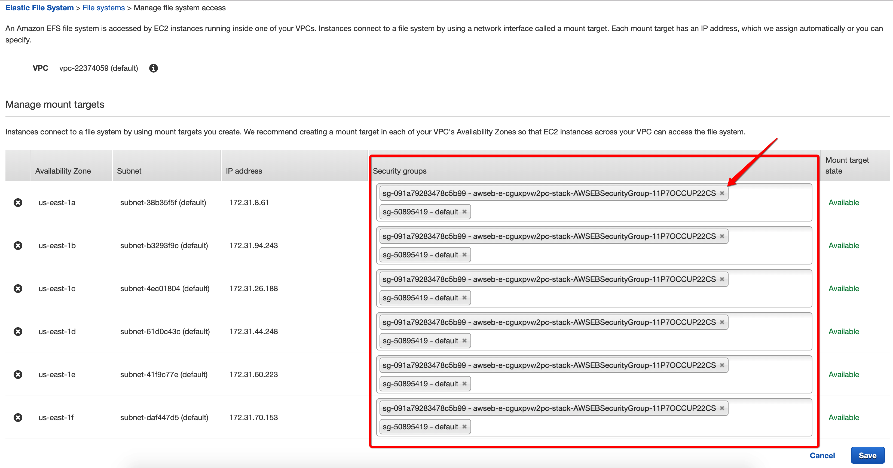

# AWS Elastic Beanstalk with Let's Encrypt Certificate

Property: Hiep Dinh

# I. Deploy Rails App to AWS Elastic Beanstalk

You can follow the article below to deploy a Rails Application to EB. I don't follow this article completely, so the content same about 90% ;)

[https://medium.com/@tranduchanh.ms/deploy-and-manage-production-rails-5-app-with-aws-elastic-beanstalk-3efb0dfe021a](https://medium.com/@tranduchanh.ms/deploy-and-manage-production-rails-5-app-with-aws-elastic-beanstalk-3efb0dfe021a)

Because my config don't match exactly with above article so I show my config in `.ebextensions` folder:
```bash
    # File .ebextensions/00_option_settings.config

    option_settings:
      - namespace: 'aws:elasticbeanstalk:command'
        option_name: 'Timeout'
        value: '1200'

    # Add file .ebextensions/01_packages.config

    packages:
      yum:
        git: []
        patch: []

    # File .ebextensions/02_commands.config

    commands:
      01_node_get:
        cwd: /tmp
        command: 'sudo curl --silent --location https://rpm.nodesource.com/setup_6.x | sudo bash -'

      02_node_install:
        cwd: /tmp
        command: 'sudo yum -y install nodejs'

      03_yarn_get:
        cwd: /tmp
        # don't run the command if yarn is already installed (file /usr/bin/yarn exists)
        test: '[ ! -f /usr/bin/yarn ] && echo "yarn not installed"'
        command: 'sudo wget https://dl.yarnpkg.com/rpm/yarn.repo -O /etc/yum.repos.d/yarn.repo'

      04_yarn_install:
        cwd: /tmp
        test: '[ ! -f /usr/bin/yarn ] && echo "yarn not installed"'
        command: 'sudo yum -y install yarn'

      05_ffmpeg_install:
        cwd: /tmp
        test: '[ ! -f /usr/bin/ffmpeg ] && echo "ffmpeg not installed"'
        command: 'sudo wget https://raw.githubusercontent.com/q3aql/ffmpeg-install/master/ffmpeg-install; sudo chmod a+x ffmpeg-install; sudo ./ffmpeg-install --install release'

      06_mkdir_webapp_dir:
        command: mkdir /home/webapp
        ignoreErrors: true

      07_chown_webapp_dir:
        command: chown webapp:webapp /home/webapp
        ignoreErrors: true

      08_chmod_webapp_dir:
        command: chmod 700 /home/webapp
        ignoreErrors: true

    # File .ebextensions/03_container_commands.config

    container_commands:
      02_compile-assets:
        cwd: '/var/app/ondeck/'
        command: bundle exec rake assets:precompile
        leader_only: 'false'
      02_webpacker-assets:
        cwd: '/var/app/ondeck/'
        command: bundle exec rails webpacker:compile
        leader_only: 'false'
      03_migration:
        cwd: '/var/app/ondeck/'
        command: bundle exec rake db:migrate
        leader_only: 'false'
```
# II. Share SSL Certificates with Elastic File System

Setup Elastic File System (EFS) to share SSL Certificates between EC2 instances (create by autoscaling in the feature)

1. At the AWS Console, we'll access to `Service > EFS (in Storage category)` ([https://us-east-1.console.aws.amazon.com/efs/home?region=us-east-1#/filesystems](https://us-east-1.console.aws.amazon.com/efs/home?region=us-east-1#/filesystems))

    Create EFS with parameters below:
```bash
        Lifecycle policy: None
        Throughput mode: Bursting
        Performance mode: General Purpose
        Enable encryption of data at rest: No
```
2. After created new EFS, we'll select it and goto `Actions > Manage file system access`, the Manage file system access appear, you have to add `Instance Security Group into Security Group column`

    

3. Set EFS DNS to EFS_URL
```bash
        eb setenv -e xxx EFS_URL=fs-6ed15f8c.efs.us-east-1.amazonaws.com
```
4. Add EB config to `mount EFS DNS to EC2 directory`


```bash
        # Add file .ebextensions/nginx/conf.d/01_efs_sharing_letsencrypt_keys.config

        packages:
          yum:
            nfs-utils: []

        commands:
          01_mount:
            command: "/tmp/mount-efs.sh"

        files:
          "/tmp/mount-efs.sh":
              mode: "000755"
              content : |
                #!/bin/bash

                # Load ENV variables
                source /opt/elasticbeanstalk/support/envvars

                EFS_MOUNT_DIR=/etc/letsencrypt

                echo "Mounting EFS filesystem ${EFS_URL} to directory ${EFS_MOUNT_DIR} ..."

                echo 'Stopping NFS ID Mapper...'
                service rpcidmapd status &> /dev/null
                if [ $? -ne 0 ] ; then
                    echo 'rpc.idmapd is already stopped!'
                else
                    service rpcidmapd stop
                    if [ $? -ne 0 ] ; then
                        echo 'ERROR: Failed to stop NFS ID Mapper!'
                        exit 1
                    fi
                fi

                echo 'Checking if EFS mount directory exists...'
                if [ ! -d ${EFS_MOUNT_DIR} ]; then
                    echo "Creating directory ${EFS_MOUNT_DIR} ..."
                    mkdir -p ${EFS_MOUNT_DIR}
                    if [ $? -ne 0 ]; then
                        echo 'ERROR: Directory creation failed!'
                        exit 1
                    fi
                else
                    echo "Directory ${EFS_MOUNT_DIR} already exists!"
                fi

                mountpoint -q ${EFS_MOUNT_DIR}
                if [ $? -ne 0 ]; then
                    echo "mount -t nfs4 -o nfsvers=4.1,rsize=1048576,wsize=1048576,hard,timeo=600,retrans=2 ${EFS_URL}:/ ${EFS_MOUNT_DIR}"
                    mount -t nfs4 -o nfsvers=4.1,rsize=1048576,wsize=1048576,hard,timeo=600,retrans=2 ${EFS_URL}:/ ${EFS_MOUNT_DIR}
                    if [ $? -ne 0 ] ; then
                        echo 'ERROR: Mount command failed!'
                        exit 1
                    fi
                    chmod 777 ${EFS_MOUNT_DIR}
                    runuser -l  ec2-user -c "touch ${EFS_MOUNT_DIR}/it_works"
                    if [[ $? -ne 0 ]]; then
                        echo 'ERROR: Permission Error!'
                        exit 1
                    else
                        runuser -l  ec2-user -c "rm -f ${EFS_MOUNT_DIR}/it_works"
                    fi
                else
                    echo "Directory ${EFS_MOUNT_DIR} is already a valid mountpoint!"
                fi

                echo 'EFS mount complete.'
```
# III. Get SSL from Let's Encrypt and NGINX work with HTTPS

1. Make sure your domain work perfect with `http` protocol. For example, my domain is `[http://xxx.com](https://xxx.com)`
```bash
        # Ensure your http protocol of your domain work perfect
        # The command below always return 200 OK
        curl xxx.com
```
2. Create a new user can manage Amazon Certificate Manager (ACM) service to `upload your certificate keys after create/renew to ACM`

    Create a new user with **Programmatic access** to get **access key ID** and **secret access key** for CLI at [https://console.aws.amazon.com/iam/home?region=us-east-1#/users](https://console.aws.amazon.com/iam/home?region=us-east-1#/users)

    **With permission**
```bash
        AutoScalingConsoleReadOnlyAccess
        AmazonEC2ReadOnlyAccess
        AWSCertificateManagerFullAccess
```
3. Setup Environment Variables
```bash
        eb setenv -e xxx RAILS_SERVE_STATIC_FILES=enabled \
          CERTBOT_EMAIL='your_email@gmail.com' \
          CERTBOT_HOST_NAME=xxx.com \
          AWS_ACM_KEY=YOUR_KEY_GOT_AT_STEP_2 \
          AWS_ACM_SECRET_ACCESS_KEY=YOUR_KEY_GOT_AT_STEP_2
```
4. Get Let's Encrypt Certificate by CertBot
```bash
        eb ssh xxx
        sudo -s
        cd /var/app/current

        # Ensure http protocol worked
        ./certbot-auto certonly --debug --non-interactive --email ${CERTBOT_EMAIL} \
          --agree-tos --standalone --keep-until-expiring \
          --domains ${CERTBOT_HOST_NAME} \
          --pre-hook "/etc/init.d/nginx stop" \
          --post-hook "/etc/init.d/nginx start"

        # Success message:
        # IMPORTANT NOTES:
        #  - Congratulations! Your certificate and chain have been saved at:
        #    /etc/letsencrypt/live/xxx.com/fullchain.pem
        #    Your key file has been saved at:
        #    /etc/letsencrypt/live/xxx.com/privkey.pem
        #    Your cert will expire on 2019-11-23. To obtain a new or tweaked
        #    version of this certificate in the future, simply run certbot-auto
        #    again. To non-interactively renew *all* of your certificates, run
        #    "certbot-auto renew"
        #  - If you like Certbot, please consider supporting our work by:

        #    Donating to ISRG / Let's Encrypt:   https://letsencrypt.org/donate
        #    Donating to EFF:                    https://eff.org/donate-le

        # To double check keys existed on your system
        ls -alR /etc/letsencrypt/{archive,live,renewal}

        # [root@ip-123-123-92-206 current]# ls -alR /etc/letsencrypt/{archive,live,renewal}
        # /etc/letsencrypt/archive:
        # total 12
        # drwx------ 3 root root 4096 Aug 25 14:30 .
        # drwxr-xr-x 9 root root 4096 Aug 25 14:30 ..
        # drwxr-xr-x 2 root root 4096 Aug 25 14:30 xxx.com

        # /etc/letsencrypt/archive/xxx.com:
        # total 24
        # drwxr-xr-x 2 root root 4096 Aug 25 14:30 .
        # drwx------ 3 root root 4096 Aug 25 14:30 ..
        # -rw-r--r-- 1 root root 2041 Aug 25 14:30 cert1.pem
        # -rw-r--r-- 1 root root 1647 Aug 25 14:30 chain1.pem
        # -rw-r--r-- 1 root root 3688 Aug 25 14:30 fullchain1.pem
        # -rw------- 1 root root 1704 Aug 25 14:30 privkey1.pem

        # /etc/letsencrypt/live:
        # total 16
        # drwx------ 3 root root 4096 Aug 25 14:30 .
        # drwxr-xr-x 9 root root 4096 Aug 25 14:30 ..
        # -rw-r--r-- 1 root root  740 Aug 25 14:30 README
        # drwxr-xr-x 2 root root 4096 Aug 25 14:30 xxx.com

        # /etc/letsencrypt/live/xxx.com:
        # total 28
        # drwxr-xr-x 2 root root 4096 Aug 25 14:30 .
        # drwx------ 3 root root 4096 Aug 25 14:30 ..
        # lrwxrwxrwx 1 root root   86 Aug 25 14:30 cert.pem -> ../../archive/xxx.com/cert1.pem
        # lrwxrwxrwx 1 root root   87 Aug 25 14:30 chain.pem -> ../../archive/xxx.com/chain1.pem
        # lrwxrwxrwx 1 root root   91 Aug 25 14:30 fullchain.pem -> ../../archive/xxx.com/fullchain1.pem
        # lrwxrwxrwx 1 root root   89 Aug 25 14:30 privkey.pem -> ../../archive/xxx.com/privkey1.pem
        # -rw-r--r-- 1 root root  692 Aug 25 14:30 README

        # /etc/letsencrypt/renewal:
        # total 12
        # drwxr-xr-x 2 root root 4096 Aug 25 14:30 .
        # drwxr-xr-x 9 root root 4096 Aug 25 14:30 ..
        # -rw-r--r-- 1 root root  824 Aug 25 14:30 xxx.com.conf
        # [root@ip-123-123-92-206 current]#

        # Create a soft link /etc/letsencrypt/live/ebcert to live keys. We will use it when setup nginx
        ln -sf /etc/letsencrypt/live/${CERTBOT_HOST_NAME} /etc/letsencrypt/live/ebcert
```
5. Upload certificate generated to ACM
```bash
        AWS_ACCESS_KEY_ID=${AWS_ACM_KEY} AWS_SECRET_ACCESS_KEY=${AWS_ACM_SECRET_ACCESS_KEY} AWS_DEFAULT_REGION=us-east-1 \
          aws acm import-certificate \
          --region us-east-1 \
          --certificate file:///etc/letsencrypt/live/ebcert/cert.pem \
          --private-key file:///etc/letsencrypt/live/ebcert/privkey.pem \
          --certificate-chain file:///etc/letsencrypt/live/ebcert/fullchain.pem

        # The response contain CertificateArn, we will use this CertificateArn to renew after 60 days
        # {
        #     "CertificateArn": "arn:aws:acm:us-east-1:246831456435:certificate/7062e36d-3bf5-4a7a-b0d7-1298d04cb03c"
        # }

        # Exit ssh session and run the command below to store CertificateArn to ENV Variable
        eb setenv -e xxx CERTIFICATE_ARN=arn:aws:acm:us-east-1:246831456435:certificate/7062e36d-3bf5-4a7a-b0d7-1298d04cb03c
```
6. Enable SSL for your AWS Load Balancer
    1. Goto AWS Console > Services > EC2 > Load Balancers
    2. Choose your load balancer attached on your instance (check in tab Instances), after that switch to `Listeners` tab
    3. Click `edit` to open popup add new port listener
    4. At popup opened, we will click `Add` and Choose SSL at `Load Balancer Protocol` and `Instance Protocol` , at column `SSL Certificate` click `Change` and choose the `certificate name` match with your domain.
7. Goto AWS Console > Services > EC2 > Security Groups
    1. Find your environment name and match with `-AWSEBLoadBalancerSecurityGroup-` at Group name. After that edit `Inbound` and `Outbound` allow `HTTPS` for `Source is 0.0.0.0/0 and ::/0`
    2. Same with `-AWSEBLoadBalancerSecurityGroup-` you also find environment name and match with `-AWSEBSecurityGroup-` at Group name and configuration the `Inbound` allow `HTTPS` for `Source is 0.0.0.0/0 and ::/0`
8. Config Nginx listion SSL port and redirect website from `non www` to `www`
```bash
        # Add file .ebextensions/nginx/conf.d/02_nginx_config.config

        Resources:
          sslSecurityGroupIngress:
            Type: AWS::EC2::SecurityGroupIngress
            Properties:
              GroupId: {"Fn::GetAtt" : ["AWSEBSecurityGroup", "GroupId"]}
              IpProtocol: tcp
              ToPort: 443
              FromPort: 443
              CidrIp: 0.0.0.0/0

        files:
          # The Nginx config forces https, and is meant as an example only.
          /etc/nginx/conf.d/http_redirect_custom.conf:
            mode: "000644"
            owner: root
            group: root
            content: |
              server {
                listen 80;
                server_name themightyendeavor.com;
                return 301 https://www.themightyendeavor.com$request_uri;
              }

              server {
                listen 443;
                server_name themightyendeavor.com;
                return 301 https://www.themightyendeavor.com$request_uri;
              }

          # The Nginx config forces https, and is meant as an example only.
          /etc/nginx/conf.d/proxy.pre:
            mode: "000644"
            owner: root
            group: root
            content: |
              upstream app {
                server unix:///var/run/puma/my_app.sock fail_timeout=0;
              }

              server {
                listen       443 default ssl;

                ssl_certificate      /etc/letsencrypt/live/ebcert/fullchain.pem;
                ssl_certificate_key  /etc/letsencrypt/live/ebcert/privkey.pem;

                ssl_session_timeout 5m;
                ssl_protocols TLSv1 TLSv1.1 TLSv1.2;
                ssl_ciphers 'ECDHE-RSA-AES128-GCM-SHA256:ECDHE-ECDSA-AES128-GCM-SHA256:ECDHE-RSA-AES256-GCM-SHA384:ECDHE-ECDSA-AES256-GCM-SHA384:DHE-RSA-AES128-GCM-SHA256:DHE-DSS-AES128-GCM-SHA256:kEDH+AESGCM:ECDHE-RSA-AES128-SHA256:ECDHE-ECDSA-AES128-SHA256:ECDHE-RSA-AES128-SHA:ECDHE-ECDSA-AES128-SHA:ECDHE-RSA-AES256-SHA384:ECDHE-ECDSA-AES256-SHA384:ECDHE-RSA-AES256-SHA:ECDHE-ECDSA-AES256-SHA:DHE-RSA-AES128-SHA256:DHE-RSA-AES128-SHA:DHE-DSS-AES128-SHA256:DHE-RSA-AES256-SHA256:DHE-DSS-AES256-SHA:DHE-RSA-AES256-SHA:AES128-GCM-SHA256:AES256-GCM-SHA384:AES128-SHA256:AES256-SHA256:AES128-SHA:AES256-SHA:AES:CAMELLIA:DES-CBC3-SHA:!aNULL:!eNULL:!EXPORT:!DES:!RC4:!MD5:!PSK:!aECDH:!EDH-DSS-DES-CBC3-SHA:!EDH-RSA-DES-CBC3-SHA:!KRB5-DES-CBC3-SHA';
                ssl_prefer_server_ciphers on;
                ssl_session_cache shared:SSL:10m;

                location ^~ /assets/ {
                  gzip_static on;
                  expires max;
                  add_header Cache-Control public;
                }

                root /var/app/current/public;
                access_log /var/log/nginx/access.log;
                error_log /var/log/nginx/error.log;

                charset utf-8;

                try_files $uri/index.html $uri @app;
                location @app {
                  proxy_pass http://app;
                  proxy_set_header  Host $host;
                  proxy_set_header  X-Forwarded-For $proxy_add_x_forwarded_for;
                  proxy_set_header  X-Forwarded-Proto $scheme;
                  proxy_set_header  X-Forwarded-Ssl on; # Optional
                  proxy_set_header  X-Forwarded-Port $server_port;
                  proxy_set_header  X-Forwarded-Host $host;
                }

                location /cable {
                  proxy_pass http://app/cable;
                  proxy_set_header Host $http_host;
                  proxy_redirect off;
                  proxy_http_version 1.1;
                  proxy_set_header Upgrade "websocket";
                  proxy_set_header Connection "Upgrade";
                  proxy_set_header X-Real-IP $remote_addr;
                  proxy_set_header X-Forwarded-Proto http;
                  proxy_set_header X-Forwarded-For $proxy_add_x_forwarded_for;
                  proxy_pass_request_headers on;

                  proxy_read_timeout 600s;
                }

                error_page 500 502 503 504 /500.html;
                keepalive_timeout 10;
                client_max_body_size 550M;
              }

        packages:
          yum:
            epel-release: []
```
# IV. Renew Let's Encrypt Certificate

1. Create Cron Job to renew certificate
```bash
        # Create file .ebextensions/nginx/conf.d/03_auto_renew_certificates.config

        files:
          "/etc/cron.d/auto_renew_certificate":
            mode: "000644"
            owner: root
            group: root
            content: |
              # The lifetime of Let’s Encrypt certificates is 90 days max. So we need executes command renew certificate at
              # 10:35am on the 28th day of every 2nd month (arbitrary, but approximately every 60 days).
              35 10 28 */2 * root /usr/local/bin/auto_renew_certificate.sh --silent >> /usr/local/bin/cron.log 2>> /usr/local/bin/cron_error.log

              # The command below only for test
              # 5,10,15,20,25,30,35,40,45,50,55 * * * * root /usr/local/bin/auto_renew_certificate.sh --silent >> /usr/local/bin/cron.log 2>> /usr/local/bin/cron_error.log

          "/usr/local/bin/auto_renew_certificate.sh":
            mode: "000755"
            owner: root
            group: root
            content: |
              #!/bin/bash

              # Load ENV variables
              source /opt/elasticbeanstalk/support/envvars

              # Only run at first instance and never run on other instance created by autoscaling
              echo "Starting job Auto Renew Let's Encrypt Certificate at" `date`
              /usr/local/bin/only_first_instance_run_job_validation.sh || exit

              echo "Run certbot-auto to renew certificate at" `date`

              cd /var/app/current/ && rm -f /var/app/current/certbot-auto && wget https://dl.eff.org/certbot-auto && \
              chmod a+x certbot-auto && ./certbot-auto certonly --force-renewal --debug --non-interactive --email ${CERTBOT_EMAIL} \
              --agree-tos --standalone --domains ${CERTBOT_HOST_NAME} --domains www.${CERTBOT_HOST_NAME}

              echo "Done Renew certificate at" `date`

              echo "Uploading certificate (renewed) at" `date`

              AWS_ACCESS_KEY_ID=${AWS_ACM_KEY} AWS_SECRET_ACCESS_KEY=${AWS_ACM_SECRET_ACCESS_KEY} AWS_DEFAULT_REGION=us-east-1 \
                aws acm import-certificate \
                --region us-east-1 \
                --certificate-arn ${CERTIFICATE_ARN} \
                --certificate file:///etc/letsencrypt/live/ebcert/cert.pem \
                --private-key file:///etc/letsencrypt/live/ebcert/privkey.pem \
                --certificate-chain file:///etc/letsencrypt/live/ebcert/fullchain.pem

              echo "Uploaded new certificate at" `date`

              echo "Finish Job Auto Renew Let's Encrypt Certificate at" `date`


          "/usr/local/bin/only_first_instance_run_job_validation.sh":
            mode: "000755"
            owner: root
            group: root
            content: |
              #!/bin/bash

              # Load ENV variables
              source /opt/elasticbeanstalk/support/envvars

              METADATA=/opt/aws/bin/ec2-metadata
              INSTANCE_ID=`$METADATA -i | awk '{print $2}'`
              REGION=`$METADATA -z | awk '{print substr($2, 0, length($2)-1)}'`

              # Find our Auto Scaling Group name.
              ASG=`AWS_ACCESS_KEY_ID=${AWS_ACM_KEY} AWS_SECRET_ACCESS_KEY=${AWS_ACM_SECRET_ACCESS_KEY} AWS_DEFAULT_REGION=us-east-1 \
                aws ec2 describe-tags --filters "Name=resource-id,Values=$INSTANCE_ID" --region $REGION --output text | \
                awk '/aws:autoscaling:groupName/ {print $5}'`

              # Find the first instance in the Group
              FIRST=`AWS_ACCESS_KEY_ID=${AWS_ACM_KEY} AWS_SECRET_ACCESS_KEY=${AWS_ACM_SECRET_ACCESS_KEY} AWS_DEFAULT_REGION=us-east-1 \
                aws autoscaling describe-auto-scaling-groups --auto-scaling-group-names $ASG \
                --region $REGION --output text | awk '/InService/ {print $4}' | sort | head -1`

              echo "Current INSTANCE_ID:" ${INSTANCE_ID}
              echo "Current FIRST INSTANCE_ID:" ${FIRST}

              # Test if they're the same.
              [ "$FIRST" = "$INSTANCE_ID" ]

        commands:
          001_rm_old_cron:
            command: "rm -f *.bak"
            cwd: "/etc/cron.d"
            ignoreErrors: true
          002_rm_old_shell_script:
            command: "rm -f *.bak"
            cwd: "/usr/local/bin"
            ignoreErrors: true
          003_create_soft_to_ebcert:
            command: "ln -sf /etc/letsencrypt/live/${CERTBOT_HOST_NAME} /etc/letsencrypt/live/ebcert"
            ignoreErrors: true
          004_update_proxy_config:
            command: "mv /etc/nginx/conf.d/proxy.pre /etc/nginx/conf.d/proxy.conf"
          005_restart_nginx:
            command: "service nginx restart || service nginx start"
```
2. Scheduling with CRON

    At this point the script was ready, and the last piece of configuration was to schedule it to run regularly within the lifetime of Let’s Encrypt certificates (90 days max). I used an online tool to help assemble the perfect crontab definition, which executes at 10:35am on the 28th day of every 2nd month (arbitrary, but approximately every 60 days).
```bash
        # The file has been created at step 1

        35 10 28 */2 * root /usr/local/bin/auto_renew_certificate.sh --silent >> /usr/local/bin/cron.log 2>> /usr/local/bin/cron_error.log
```
